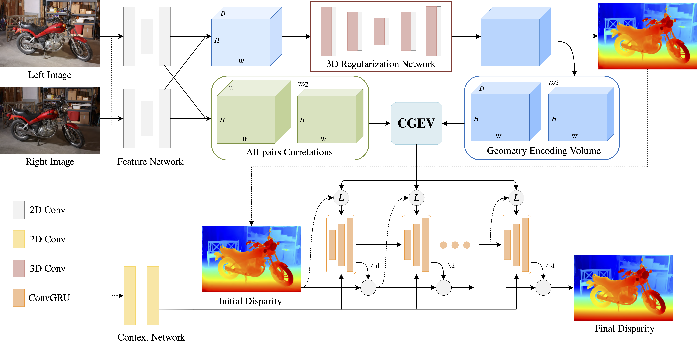
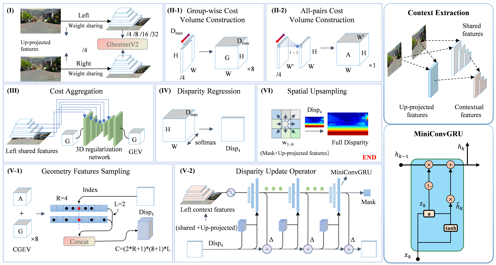
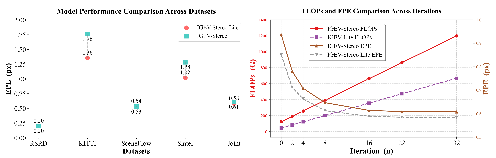
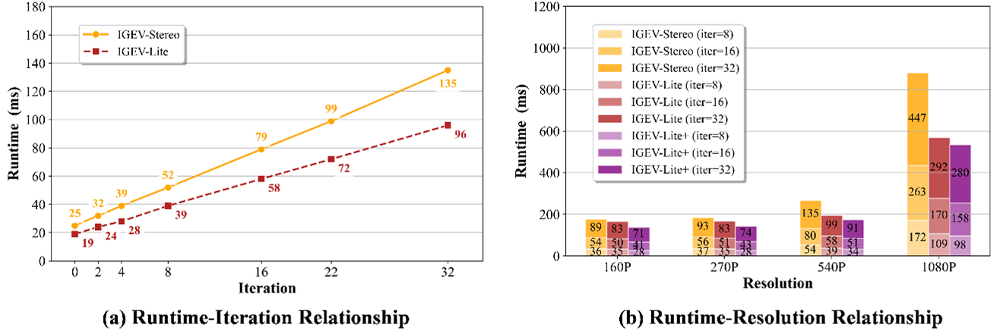
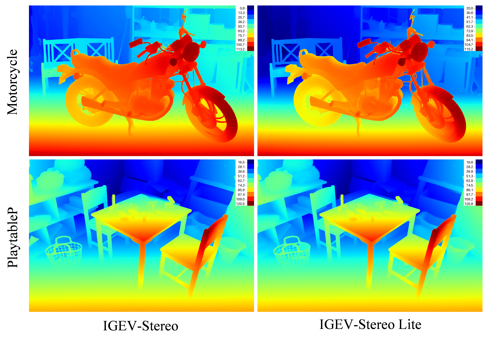

# Iterative Geometry Encoding Volume stereo-Lite
> Core code reference: igev_lite and associated files in the core directory

Research Source: 

Real-time stereo reconstruction and geometric quantification of pavement distress with a variable-baseline platform

## 1. Network
> IGEV-Stereo
> source: https://github.com/gangweiX/IGEV

> IGEV-Stereo Lite

> Comparison


> Demo


## 2. Environment Setup
Install other dependencies
```
pip install -r requirements.txt
```
## 3. Evaluation Datasets
```data
└── Datasets
    |- kitti12/15 (kitti.yaml)
    |- SceneFlow (sceneflow.yaml)
    |- Sintel (sintel.yaml)
    |- RSRD (RSRD.yaml)
KITTI: https://www.cvlibs.net/datasets/kitti/eval_scene_flow.php?benchmark=stereo
SceneFlow: https://lmb.informatik.uni-freiburg.de/resources/datasets/SceneFlowDatasets.en.html#downloads
Sintel: http://sintel.is.tue.mpg.de/
RSRD: https://thu-rsxd.com/rsrd/
```

## 4. Testing
```
python testModel.py
```

